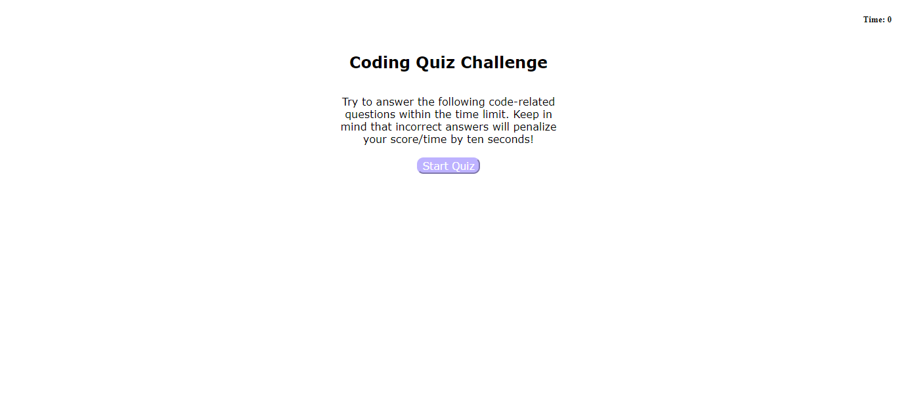

<h1>Code-Quiz</h1>
    
This repo houses the codes used to build code quiz webpage, available at https://khklee.github.io/Code-Quiz/. 

<h3>Website Description</h3>
    
Code Quiz is a timed coding quiz with multiple-choice questions. When the user answers a question incorrectly, time is subtracted from total time 75 seconds. When all questions are answer or the timer reaches 0, the quiz is over. The website prompts the user to enter their initial to save their scores.
    

<h3>Website Screenshot</h3>
    
    
    
    